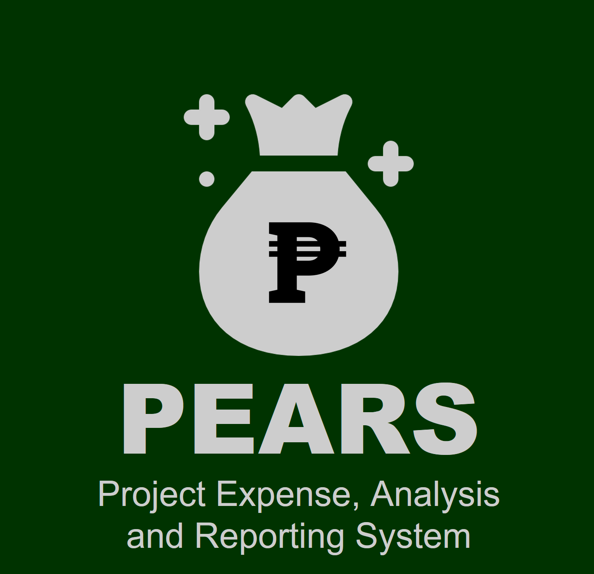
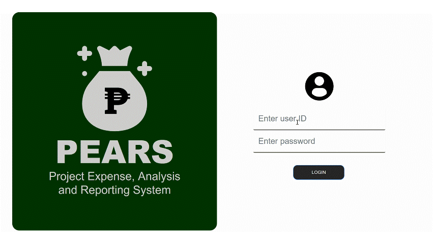
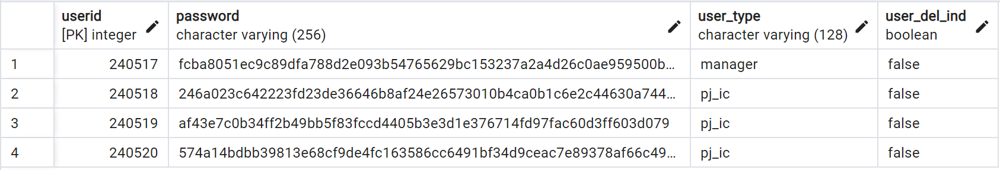
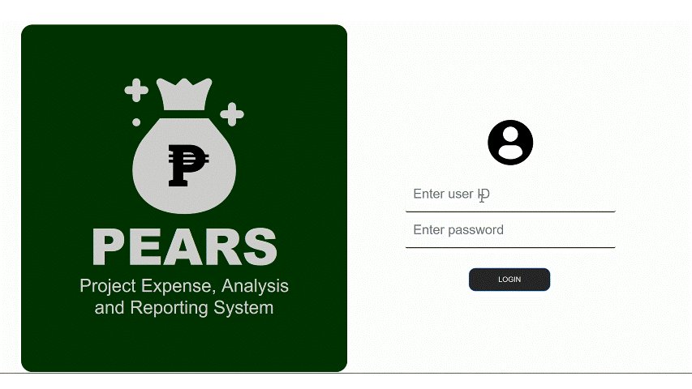
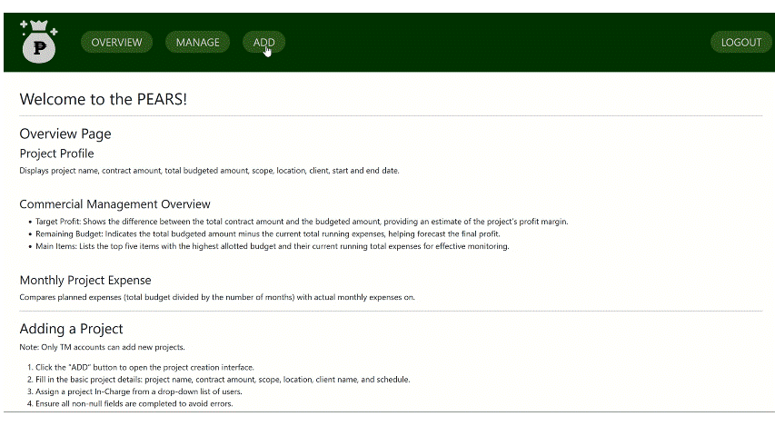
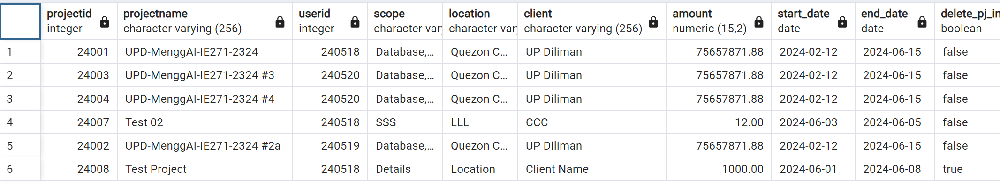
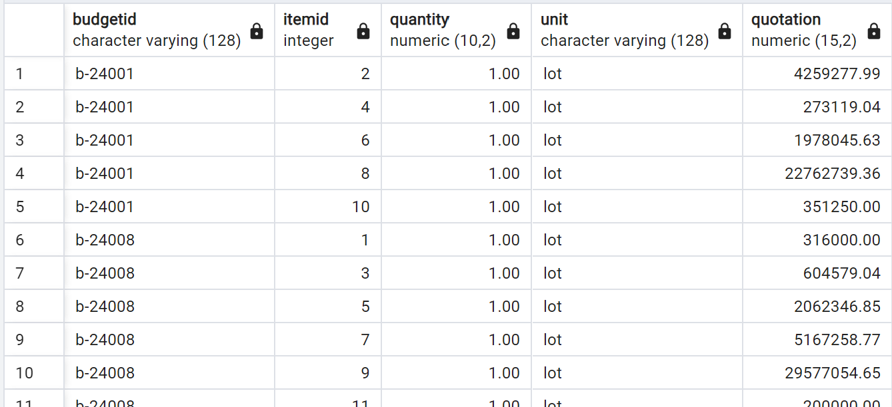
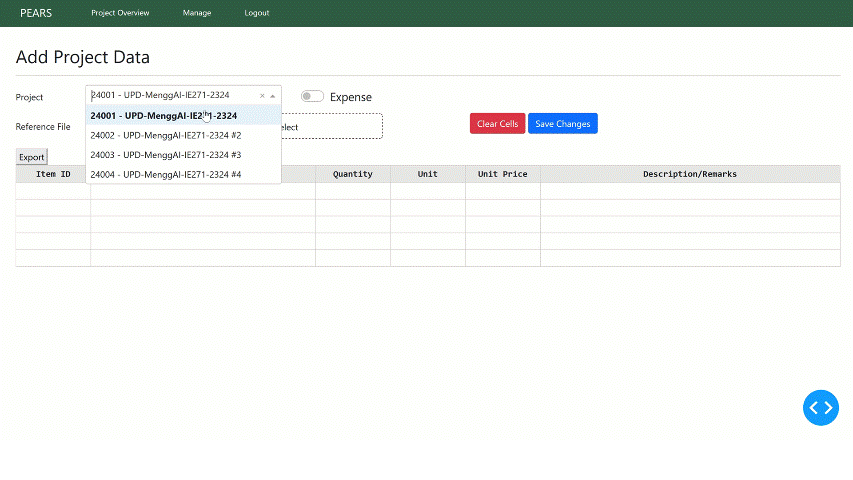
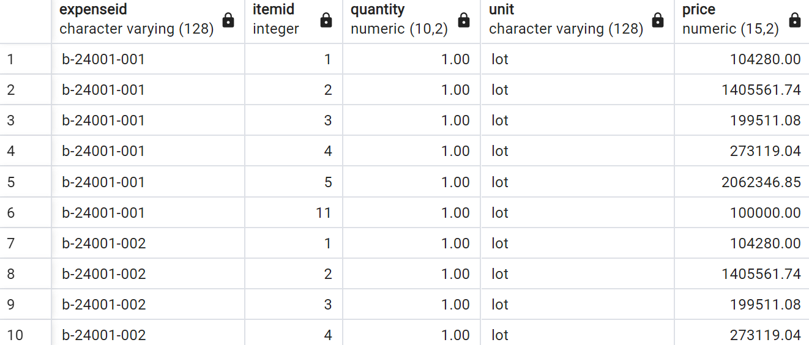

# PEARS Dashapp

<!--  -->

**Project Expense, Analysis and Reporting System (PEARS)** is a web-based financial management application for small-scale projects and companies. Developed using Python integrated with PostgreSQL, the app enables efficient project cost control by creating a centralized database for multiple projects, allowing users to formulate budgets, track monthly expenses, and ensure financial transparency.

<details close>
<summary>Open for installation guide</summary>

## Installing Locally
To run this project locally, please follow these steps:

### A. Clone the repository:
   ```
   git clone https://github.com/josh-rdc/PEARS-dashapp
   ```

### B. Setup the database  
1. Ensure **PostgreSQL is installed on your machine**. Follow this [PostgreSQL Tutorial Page](https://neon.tech/postgresql/postgresql-getting-started/install-postgresql) if not.

   To check if the app is installed and added to your environment variables properly, run the version inquiry in the terminal:
   ```
   psql --version
   ```

2. **Create the Database**

   To create the database, log in to your PostgreSQL server:
   ```
   psql -U postgres
   ```

   Run the following command to create the database `PEARSdb`:
   ```
   CREATE DATABASE PEARSdb;
   ```

   Exit the psql shell:
   ```
   \q
   ```

3. **Build the Schema tables**

   Navigate to the `App Files` folder from the cloned repository:
   ```
   cd "C:\Users\Josh\000 Files\010 Portfolio\04 PEARS-dashapp\App Files"
   ```

   Run the following terminal command to create the required tables from the `create_tables.sql` file:
   ```
   psql -U postgres -d PEARSdb -f create_tables.sql
   ```

4. Update the `apps/dbconnect.py` file with your PostgreSQL connection details:
   ```
   db = psycopg2.connect(
    host='localhost',          # Update if running on a different host
    database='PEARSdb',        # Database name
    user='your_username',      # PostgreSQL username
    port=5432,                 # Default PostgreSQL port
    password='your_password'   # PostgreSQL password
   )
   ```

### C. Setup the app
1. Install the required libraries:
   ```
   pip install -r requirements.txt
   ```
   

2. Run the application:
   ```
   python app.py
   ```

</details>

## App Pages
- [Log-in and Home Page](#log-in-and-home-page)
- [Overview Page](#overview-page)
- [Adding A Project](#adding-a-project)
- [Adding Project Data](#adding-project-data-budget-and-expense)

---

### Log-in and Home Page


- Each user has an individual account to log in to the application.
- User credentials (user ID and password) are created and managed by the application admin to control access.
- User roles are divided into two:
   1. Top Management **(TM)** which has access to all projects and could add new projects.
   2. Project-In-Charge **(PIC)** which has only access to specific projects assigned to them.

   <details close>
   <summary>PostgreSQL Table Sample</summary>
   Sample `users` table:
   

   </details>

- After logging in, users are directed to the homepage which includes:
  - Details about the report generation process.
  - Descriptions of the application's features and how to use them.
  - Definitions of available pages and their contents.

--- 

### Overview Page


- **Project Profile** displays project name, contract amount, total budgeted amount, scope, location, client, start and end date.

- **Commercial Management Overview**

   1. **Target Profit**: Shows the difference between the total contract amount and the budgeted amount, providing an estimate of the project’s profit margin.
   2. **Remaining Budget**: Indicates the total budgeted amount minus the current total running expenses, helping forecast the final profit.
   3. **Main Items**: Lists the top five items with the highest allotted budget and their current running total expenses for effective monitoring.

- **Monthly Project Expense** compares planned expenses (total budget divided by the number of months) with actual expenses on a monthly basis.

--- 

### Adding A Project


   `Only TM accounts can add new projects.`
   1.	Click the “ADD” button to open the project creation interface.
   2.	Fill in the basic project details: project name, contract amount, scope, location, client name, and schedule.
   3.	Assign a project In-Charge from a drop-down list of users.
   4.	Ensure all non-null fields are completed to avoid errors.
   
   <details close>
   <summary>PostgreSQL Table Sample</summary>

   Sample `projects` table:
   
   -	**Project ID is a 5-digit number automatically generated by the system**; takes the form of YYXXX (last two digit of the year then three-digit number starting from 001)
   -	A project In-charge ID can be assigned to multiple projects

   </details>
--- 

### Adding Project Data (Budget and Expense)

- **General Interface**
   1. Access the "MANAGE" tab from the navigation bar.
   2. Select the project to manage from the project form.
   3. TM accounts can edit data for all projects, while **PIC accounts can only edit their assigned projects**.

- **Budget Mode**
   
   1. Toggle to `“Budget”` mode.
   2. Enter budget data directly into the table or upload a CSV file.
   3. Based on needed action, table contents could be cleared or saved to the project budget.

   <details close>
   <summary>PostgreSQL Table Sample</summary>

   Sample `budgets` table:
   
   - **Budget ID is automatically generated based on the Project ID and takes the form “b-YYXXX”** (adds a prefix “b-“ to the Project ID for easy recognition)
   - Items database will take all the items across different projects. **Item ID is also automatically generated** via the “Serial” method in SQL. Perform checks whenever a budget is uploaded, if an item name already exist in the database, similar item ID is used, if new item ID is uploaded, assign a new item ID.  

   </details>

- **Expense Mode**


   1. Toggle to `“Expense”` mode.
   2. Enter expenses into the table or upload a CSV file.
   3. Based on needed action, table contents could be cleared or saved to the project expenses.
   4. Ensure expenses are budgeted and item names match the budget exactly.

   <details close>
   <summary>PostgreSQL Table Sample</summary>

   Sample `expense` table:
   
   - **Expense ID is also an automatically generated ID based from the Budget ID which takes the form “b-YYXXX-XXX"** (simply adds “-XXX” starting from -001 to the Budget ID). This enables the user to add multiply expenses to the project while emphasizing the source budget.
   -	Item ID automatically matches the Item Name from the Item Database. 
   -	When an item name not listed in the budget is attempted to be saved in the database, an error will occur indicating the that expenses should be budgeted.
   -	This also add the constraint that the item name should perfectly match the names initially indicated in the budget. For example, Indirect Labor indicated in budget cannot be saved as Indirect in the expense.

   </details>